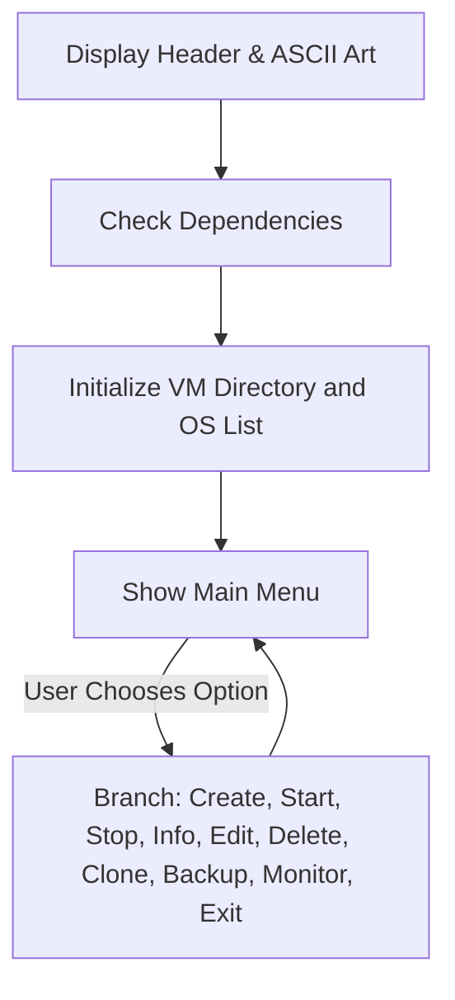
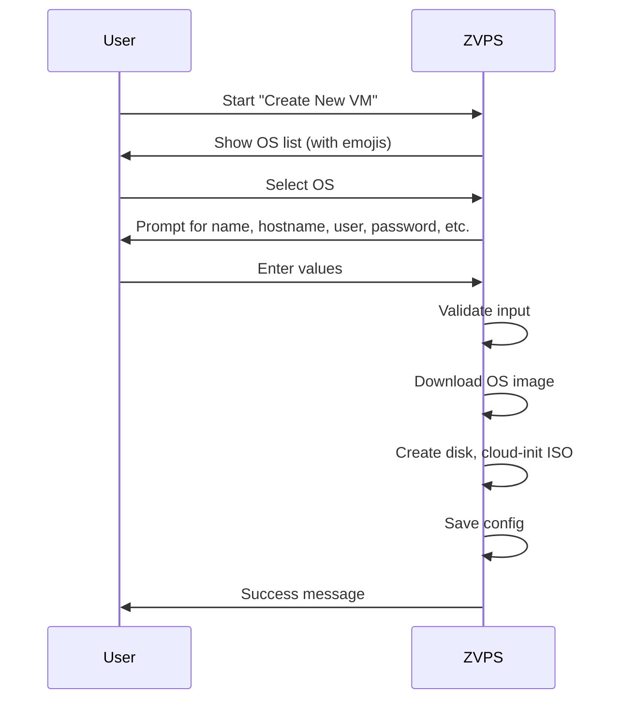

# ZVPS Lightning-Fast Virtual Machine Manager 🚀

ZVPS is a high-performance, interactive, and user-friendly **Bash-based VM Manager** for Linux. It enables you to create, manage, backup, and monitor virtual machines (VMs) with incredible speed and ease—all from a colorful, emoji-rich TUI menu! Whether you are a developer, sysadmin, or enthusiast, ZVPS delivers a smooth VM experience out of the box.

---

## Project Credits & Visual Branding


> **Credits**: HopingBoyz & Jishnu Tech  
> **Modified by**: ZDEV07


---

## Supported Technologies

> **Docker** 
> **QEMU**
> **NPM**
---

# vm.sh — ZVPS Main Script Detailed Documentation

The `vm.sh` script is the heart of the ZVPS project. It provides a robust and interactive TUI (Text User Interface) for all aspects of VM lifecycle management using QEMU/KVM, cloud images, and cloud-init.

---

## Key Features of `vm.sh`

- **Interactive Menu System**: Navigate all actions via an intuitive menu with emoji-enhanced feedback.
- **OS Image Support**: Quickly deploy popular Linux distros (Ubuntu, Debian, Fedora, CentOS, AlmaLinux, Rocky Linux).
- **Cloud-Init Automation**: Secure, password-authenticated SSH out-of-the-box for every VM.
- **Resource Control**: Customize RAM, CPU, disk, networking, and more for each VM.
- **Backup & Clone**: Instantly backup or duplicate your VMs.
- **Performance Monitoring**: Real-time process, memory, and disk usage per VM.
- **GUI/Headless Modes**: Choose between graphical or console-only VM launches.
- **Port Forwarding**: Map any host port to guest services for easy access.
- **Config Editing**: Edit all VM settings interactively post-creation.
- **Dependency Checks**: Ensures all tools are installed before running.

---

## How It Works: High-Level Flow



---

## Menu Overview

| Option                         | Action                                           |
|------------------------------- |-------------------------------------------------|
| 🆕  Create a new VM             | Launch VM creation wizard                       |
| 🚀  Start a VM                  | Start one of your VMs                           |
| 🛑  Stop a VM                   | Gracefully stop a running VM                    |
| ℹ️   Show VM info                | Display all properties of a VM                  |
| ⚙️   Edit VM configuration       | Edit CPU, RAM, disk, user, ports, etc.          |
| 🗑️  Delete a VM                 | Remove a VM and all its files                   |
| 📊  Show VM performance         | See live process, memory, and disk stats        |
| 📋  Clone a VM                  | Duplicate a VM with new name and SSH port       |
| 💾  Backup VM                   | Archive all critical files for the VM           |
| 👋  Exit                        | Quit ZVPS                                       |

---

## Supported Operating Systems

- 🟠 Ubuntu 22.04 LTS & 24.04 LTS
- 🔴 Debian 11 (Bullseye) & 12 (Bookworm)
- 🔵 Fedora 40
- 🟣 CentOS Stream 9
- 🟢 AlmaLinux 9
- 🟡 Rocky Linux 9

Each OS includes default user/passwords and is fetched as a cloud image (qcow2 format).

---

## Core Components & Logic

### Colorful, Emoji-Rich Status Messages

All user feedback is color-coded and emoji-annotated:

| Type      | Emoji  | Color    | Example Output                           |
|-----------|--------|----------|------------------------------------------|
| INFO      | ℹ️     | Blue     | General info                             |
| SUCCESS   | ✅     | Green    | Successful operation                     |
| ERROR     | ❌     | Red      | Errors or failures                       |
| PROGRESS  | ⏳     | Magenta  | Ongoing operations                       |
| ROCKET    | 🚀     | Yellow   | VM start/launch                          |
| STOP      | 🛑     | Red      | VM stopping                              |
| DELETE    | 🗑️     | Red      | VM/file deletion                         |
| CONFIG    | ⚙️     | Cyan     | Configuration steps                      |
| INPUT     | 📝     | Cyan     | Prompts for user input                   |

---

### Dependency Checking

Before any operation, ZVPS checks for:

- `qemu-system-x86_64`
- `wget`
- `cloud-localds`
- `qemu-img`

If missing, installation hints are provided.

---

### VM Lifecycle Management

#### Creating a New VM

1. **OS Selection** (with emoji icons)
2. **Config Wizard** (name, hostname, user, password, disk, RAM, CPUs, SSH port, GUI/headless)
3. **Image Handling**: Download selected image and resize disk.
4. **Cloud-Init**: Generates usable credentials and cloud-init ISO.
5. **Config Save**: All details stored as shell variables for reload.

#### Starting a VM

- Loads configuration and builds an optimized QEMU command.
- Supports Quick Boot tweaks, virtio devices, SSH port forwarding, GUI/headless, and user-specified additional ports.

#### Stopping a VM

- Gracefully (SIGTERM) or forcibly (SIGKILL) stops the VM process.

#### VM Info, Edit, Clone, and Backup

- Show all settings and runtime status.
- Edit any property interactively; critical changes trigger new cloud-init data.
- Clone duplicates image, config, and ISO; assign new SSH port.
- Backup archives image, ISO, and config with optional compression.

---

## Example: New VM Creation Workflow



---

## Configuration Storage

- Each VM stores config as a `.conf` file with shell variables.
- Disk and cloud-init ISO files are kept in a user-specific `zvps-vms` directory.

---

## Security Considerations

- SSH is password-authenticated; password stored in config.
- Usernames are validated for Linux POSIX compliance.
- Cloud-init disables root password lock if user chooses.

---

## Performance Monitoring

- For running VMs, displays:
  - Process PID, CPU%, RAM%, RSS, VSZ, command
  - Memory (from `free -h`)
  - Disk file size and info

---

## Example Terminal UI

```text
╔══════════════════════════════════════════════════════════════════╗
║ ███████╗██╗  ██╗██████╗ ███████╗                                ║
║ ⚡ Lightning-Fast Virtual Machine Manager ⚡                     ║
║ 🚀 Powered by ZVPS Technology 🚀                                ║
╚══════════════════════════════════════════════════════════════════╝

📦 Your Virtual Machines:
  1) 🟢 ubuntu22 (Running)
  2) 🔴 debian12 (Stopped)

🎯 Main Menu:
  1) 🆕 Create a new VM
  2) 🚀 Start a VM
  ...
  0) 👋 Exit
```

---

## Example Configuration File

```bash
VM_NAME="ubuntu22"
OS_TYPE="ubuntu"
CODENAME="jammy"
IMG_URL="https://cloud-images.ubuntu.com/jammy/current/jammy-server-cloudimg-amd64.img"
HOSTNAME="ubuntu22"
USERNAME="ubuntu"
PASSWORD="ubuntu"
DISK_SIZE="20G"
MEMORY="2048"
CPUS="2"
SSH_PORT="2222"
GUI_MODE="false"
QUICK_BOOT="true"
PORT_FORWARDS=""
IMG_FILE="$HOME/zvps-vms/ubuntu22.img"
SEED_FILE="$HOME/zvps-vms/ubuntu22-seed.iso"
CREATED="2024-06-07 14:15:00"
```

---

## Advanced Features

- **Quick Boot**: Disables unnecessary QEMU features for faster startup.
- **Virtio Devices**: Optimizes storage and networking performance.
- **Port Forwards**: Add any number of host:guest TCP forwards.
- **Clone/Backup**: Instantly duplicate or archive complete VM state, with optional compression.

---

## Typical Use Cases

- Local development environments for any Linux OS.
- Testing automation with easily resettable VMs.
- Creating reproducible OS images for teaching or devops.
- Simple, portable VM management on any Linux desktop/server.

---

## Highlight: Why ZVPS Is a Great Tool

```card
{
    "title": "Why Use ZVPS?",
    "content": "ZVPS makes VM management fun, fast, and approachable for everyone. Its interactive interface, emoji feedback, and simple config system let you control virtual machines efficiently—no cloud account or heavy hypervisor needed!"
}
```

---

# Installation

For a one-click installation, use the provided command (see README for updates).  
**Dependencies:**  
- QEMU (qemu-system-x86_64)
- wget
- cloud-image-utils (for cloud-localds)
- bash

---

# FAQ

- **Q:** Does ZVPS support Windows images?  
  **A:** No, only cloud-ready Linux distributions.

- **Q:** Can I migrate VMs between hosts?  
  **A:** Yes, copy the VM directory (`$HOME/zvps-vms`) to your new machine.

- **Q:** Is it secure?  
  **A:** Credentials are stored locally; use secure passwords and limit access to your machine.

---

# Final Notes

ZVPS brings the power of virtualization to your fingertips. Enjoy lightning-fast VM setup, effortless management, and robust backup/clone features—all in a single script.  
Start creating your virtual lab today! 🚀

---

**CREDITS:**  
HopingBoyz & Jishnu Tech  
Modified by ZDEV07

---

**For support or contributions, see the project repository or join our Discord!**
